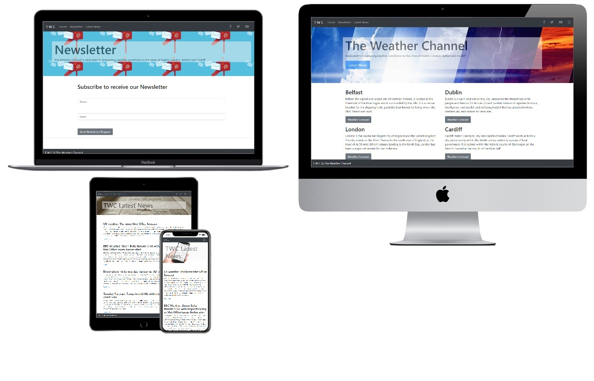

<h1>TWC - The Weather Channel</h1>

Welcome,

For my Milestone 2 Project with [Code Institute](https://codeinstitute.net/), I had the challenge to incorporate a website using JavaScript. I decided to create a weather channel to make a interactive API to bring the latest online weather and news for the users.
The channel broadcasts weather forecasts and weather-related news, along with a newsletter. The rapidAPI update the information of the weather and weather-related news.

### [View TWC website in github pages](https://gersonvj.github.io/TWC---THE-WEATHER-CHANNEL/)

# Table of contents
- [UX](#ux)
    - [Website goals](#website-goals)
    - [User Stories](#user-stories)        
    - [Wireframes](#wireframes)
- [Features](#features)
- [Technology](#Technologies-Used)
- [Testing](#testing) 
- [Deployment](#deployment)
- [Credits](#credits)

# Ux Structure

## Website Goals

<ul>
 <li>As the user opens the home page, will see a jumbotrom that highlights the page the user is into. With four cards having a brief describle of the cities and a button that open a popup card to show some weather information of the city connected via API.</li>
 <li>Our latest news are conected via API aswell showing the last 4 weather-related news with a "Read More" link to the user see the news from the original website.</li>
 <li>The newsletter is a emailJS that send to the user a email with the temperature of the cities (not connected with an API).</li>
</ul>

## User Stories

   * I want to go onto a responsive page with minimal loading time.
   * I want to go onto a page and understand what sort of content is available.
   * I want an easy and accessable navigation menu.
   * I want to know what is the weather in these cities.
   * I want to know more about wheater with online news.
   * I want to be able to read more about the news showing in the page.
   * I want to receive a email with the weather of these cities.
   * I want the other useful information including social media links.

## Wireframes
I created some wireframes to get an understanding of how I wanted to present the website on view. This way I could improve it where necessary or find alternate ways to produce a better product.

Links to Wireframes
I have uploaded my Wireframes up into the Wireframes Repository directory: https://github.com/gersonvj/TWC---THE-WEATHER-CHANNEL/tree/master/assets/wireframes.
There are 4 files in there:
 * [indextwc.jpg](https://github.com/gersonvj/TWC---THE-WEATHER-CHANNEL/blob/master/assets/wireframes/indextwc.jpg) shows the ideia for the main page. 
 * [newstwc.jpg](https://github.com/gersonvj/TWC---THE-WEATHER-CHANNEL/blob/master/assets/wireframes/newstwc.jpg) is a mockup of the presenteation of the news page.
 * [newslettertwc.jpg](https://github.com/gersonvj/TWC---THE-WEATHER-CHANNEL/blob/master/assets/wireframes/newslettertwc.jpg) is the wireframe for the newsletter page.
 * [first example twc.pdf](https://github.com/gersonvj/TWC---THE-WEATHER-CHANNEL/blob/master/assets/wireframes/first%20example%20twc.pdf) is the main concept used to develop the TWC website.

# Features

<ul>Existing Features:
  <li>Home page: The ideia is to make the user to click on the weather forecast buttons to see the forecast weather.</li>
  <li>Newsletter: Make the user connected with the page, receiving a basic email that will lead him to get back to the website to see more abou the weather forecast.</li>
  <li>Latest News: Show for the user the last 4 weather-related news of the API.</li>
</ul>

<ul>Future Features:
  <li>Home page: A search button for the user to see more weather of another cities in the world</li>
  <li>Newsletter: make it connected with the weather API, so when the user receive the newsletter this will be updated with the latest forecast.</li>
  <li>Latest News: a country/city search button for the latest weather-related news </li>
</ul>

# Technologies Used

[HTML5](https://en.wikipedia.org/wiki/HTML5)
<ul>
    <li>The main structure to create the webpage</li>
  </ul>

[CSS3](https://en.wikipedia.org/wiki/Cascading_Style_Sheets)
<ul>
    <li>The design to create a good user experience</li>
  </ul>

[Bootstrap](https://getbootstrap.com/docs/4.4/getting-started/introduction/)
  <ul>
    <li>Responsive framework, used to create the layout structure of the site on all platforms (desktop, mobile, ipad). I also used bootstrap to create the NavBar, Newsletter and Contact Form</li>
  </ul>

[Hoover Library](https://cdnjs.cloudflare.com/ajax/libs/hover.css/2.1.1/css/hover-min.css)
<ul>
    <li>Library used to hoover the buttons </li>
  </ul>

 
[JavaScript](https://en.wikipedia.org/wiki/JavaScript)
<ul>
    <li>JavaScript is a dynamic computer programming language. It is lightweight and most commonly used as a part of web pages, whose implementations allow client-side script to interact with the user and make dynamic pages. It is an interpreted programming language with object-oriented capabilities</li>
  </ul>
  
[RapidAPI](https://rapidapi.com/marketplace</h4>)
  <ul>
    <li>RapidAPI, the world's largest API Marketplace, is used by over one million developers to find, test, and connect to thousands of APIs — all with a single account, API Key, and SDK.</li>
    <li>You will want to begin by signing up for a free RapidAPI Account if you don't already have one. An account is required to test APIs, integrate them into your application, and track analytics. Sign up from the Homepage www.rapidapi.com by clicking the button in the top right corner.</li>
    <li>You can learn how to use the RapidAPI Marketplace to make your first API call, and integrate APIs into your application fast clicking in this website: https://docs.rapidapi.com/docs/basics-creating-a-project</li>
  </ul>

[EmailJS](https://www.emailjs.com/)
<ul>
    <li>EmailJS is not sending the emails directly. Instead, it allows users to connect their email services, through which the emails will be sent.</li>
    <li>You need to create a free account to use the service. https://dashboard.emailjs.com/sign-up </li>
    <li>To start using the service, you can use these steps: https://www.emailjs.com/docs/tutorial/adding-email-service/</li>
    <li>Used to build the emailing system in the contact form. Connect email service to send emails via JavaScript</li>
  </ul>
  
[Github](https://www.github.com/)
<ul>
    <li>GitHub is a Git repository hosting service, but it adds many of its own features. While Git is a command line tool, GitHub provides a Web-based graphical interface. It also provides access control and several collaboration features, such as a wikis and basic task management tools for every project</li>
  </ul>
  
[Gitpod](https://www.gitpod.io/)
<ul>
    <li>Gitpod is an open source platform for automated and ready-to-code development environments that blends into your existing workflow. It enables developers to describe their dev environment as code and start instant and fresh development environments for each new task directly from your browser.</li>
  </ul>

  
  

# Testing

W3C Validator was used to validate all my code and outline any errors. https://validator.w3.org/

Chrome Dev Tools was used to test out my code and be able to make adjustments. This was a constant use of mine throughout my development. https://developers.google.com/web/tools/chrome-devtools

JSHint was used to test out my JavaScript. https://jshint.com/

<ul>
<li>05/11/2020 - Not reponsive for phone devices, background pictures for jumbotrom not working, h1 headers need more margin.</li>
 <ul>
  <li>(update 10/12/2020) - reponsive for phone devices, background pictures working in jumbotrom and h1 margins adequate for the UX </li>
 </ul>
<li>06/11/2020 - Homepage responsive for all devices, newsletter and latest news not responsive for phone devices.</li>
 <ul>
   <li>(update 11/12/2020): All the pages are responsive for the devices tested below and some devices tsted in the chrome developer tool.</li>
 </ul>
<li>08/11/2020 - Weather cards background not working, weather icon from API not showing in the cards. 
 <ul>
  <li>(update 10/12/2020): All weather cards have a background image from the city the user is looking for it.</li>
  <li> (update 11/12/2020): The Icon information comming from the API is showing perfect in the weather cards.</li>
 </ul>
<li>09/11/2020 - Newsletter responsive for phone devices, no defensive desing in the forms. 
 <ul>
   <li>(update 17/12/2020): All the forms in the newsletter section have a defensive design, not letting the user making mistakes when subscribe to the newsletter.</li>
   <li>Try to submit the form with empty fields and you will get an error message that requests to fill out form, starting with the Name input.</li>
   <li>Try to submit the form without a valid syntaxt email will request the user to input a valid email address.</li>
   <li>Once you have submitted with all fields filled out, the Console should read Success if successful, or Failure if there is an error.</li>
   <li>You should receieve an alert box saying 'Message Recieved' if successful.</li>
   <li>You should receieve an automated reply to the email used to send coming from the website email.</li>
</ul>

<li>09/11/2020 - Latest news link are outside the row, making not responsive.</li>
 <ul>
  <li>(update 23/12/2020): changed the way to show the link for the user in the news page, make it easier to be responsive, instead of show the whole link I changed to a "Read More" link that suits for all the devices and make it responsive.</li>
 </ul>
 
<li>10/11/2020 - All pages are responsive. Some images are streching. 
 <ul>
  <li>(update 15/12/2020): some images where changed to make more user friendly and responsive. On the News section the image for laptops and Ipads are different from the phones devices make it responsive and not streching the images.</li>
 </ul>  
</ul>

Actual devices used for the test: iPhone 6s, Motorola and G5, Samsung S20 5g, Samsung Note 10 - Latest news not fully responsive.
<ul>
 <li>(update 21/12/2020) - The link problem was solved changing the view of the link for the user for a "Read More" link, in this way the link is not broken the website, making fully responsive for phone devices.</li>
</ul>
 
 
No broken links in the images, buttons or social networks.
Web Browsers - Chrome and Firefox - working perfectly.

# Deployment

Deployed using GitHub Pages accessed via the link below
 - https://gersonvj.github.io/TWC---THE-WEATHER-CHANNEL/
 index.html is main content page - all other navigatable via this webpage

  **Process**
   1. Created a Github account at https://github.com My account: https://github.com/gersonvj

   2. Synced folder on local machine to Github Repo via VsCode: https://github.com/gersonvj/TWC---THE-WEATHER-CHANNEL

   3. To publish the project to see it on the web go to Settings on Repo , scroll down to the heading, GitHub Pages. Under the Source setting, Use drop-down menu to select master branch as a publishing source and save. Refreshed the github page, and you are then given a url where your page is published; The site is now published on gitHub pages at https://gersonvj.github.io/TWC---THE-WEATHER-CHANNEL/

   4. To run this code on your local machine, you would go to my respository at https://github.com/gersonvj/TWC---THE-WEATHER-CHANNEL and on the home page on the right hand side just above all the files, you will see a green button that says, "Clone or download", this button will give you options to clone with HTTPS, open in desktop or download as a zip file. Then --> click the clipboard item to copy the Https address of the repo.
   
   5. Open Git Bash/Terminal: 
   CD the working directory to the location where you want the cloned directory to be made.you can use mkdir command to make a new directory, then cd into it.Type git clone, and then paste the URL: https://github.com/gersonvj/TWC---THE-WEATHER-CHANNEL.git Press Enter. The clone is created.
   For more information about the above process; https://help.github.com/en/github/using-git/which-remote-url-should-i-use

# Credits

* To complete this project I used Code Institute student template: [gitpod full template](https://github.com/Code-Institute-Org/gitpod-full-template)

* Ideas and knowledge library:

    * [w3schools.com](https://www.w3schools.com)

    * [getbootstrap.com/docs](https://getbootstrap.com/docs/4.5/getting-started/introduction/)
        I used code for navbar, jumbotron and card from Bootstrap.

### Code

* Bootstrap: [Burger menu](https://getbootstrap.com/docs/4.5/components/navbar/#text)
* Bootstrap: [Jumbotron](https://getbootstrap.com/docs/4.5/components/jumbotron/)
* Bootstrap: [Form](https://getbootstrap.com/docs/4.5/components/forms/)

<h5>Content</h5>

<ul>
    <li>The description of the cities were taking from: www.google.com</li>
</ul>

<h5>Media</h5>
<ul>
  <li>The artwork used in this site were obtained from: https://www.instagram.com/artworkbyshane/</li>
</ul>

<h5>Acknowledgements</h5>
<ul>
  <li>This project is thinking to show the users the forecast and weather-related news from API as the newsletter using mailJS.</li>
</ul>
